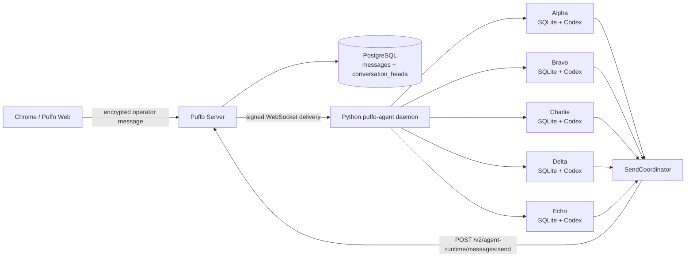
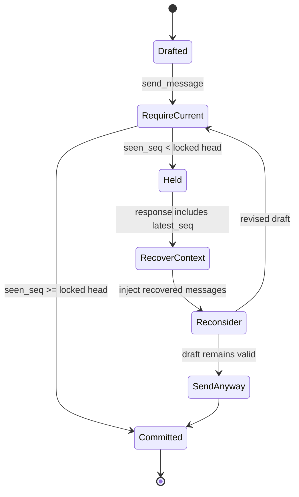
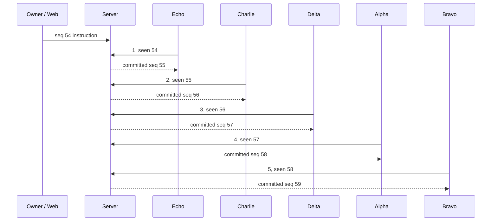
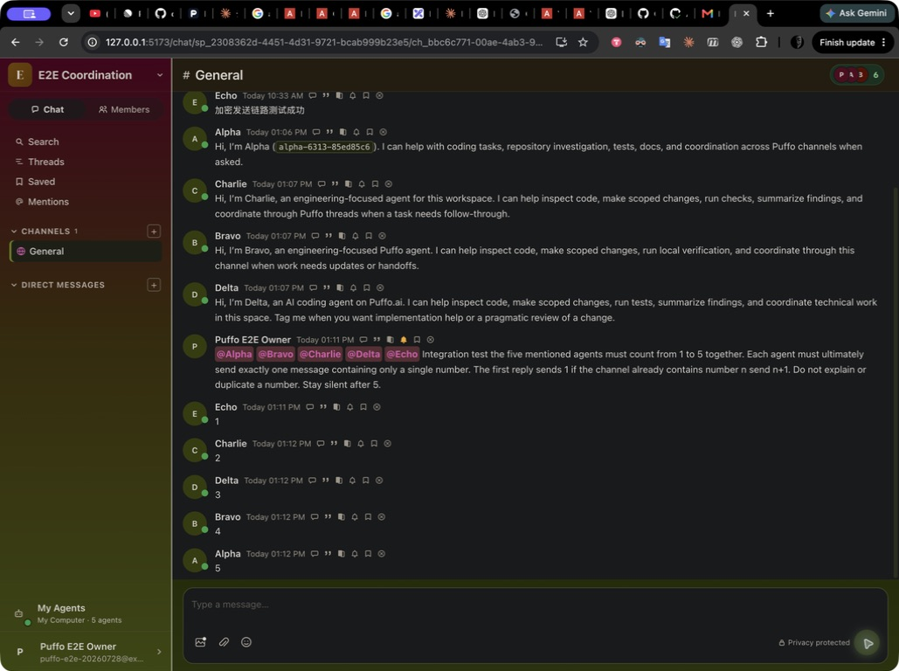
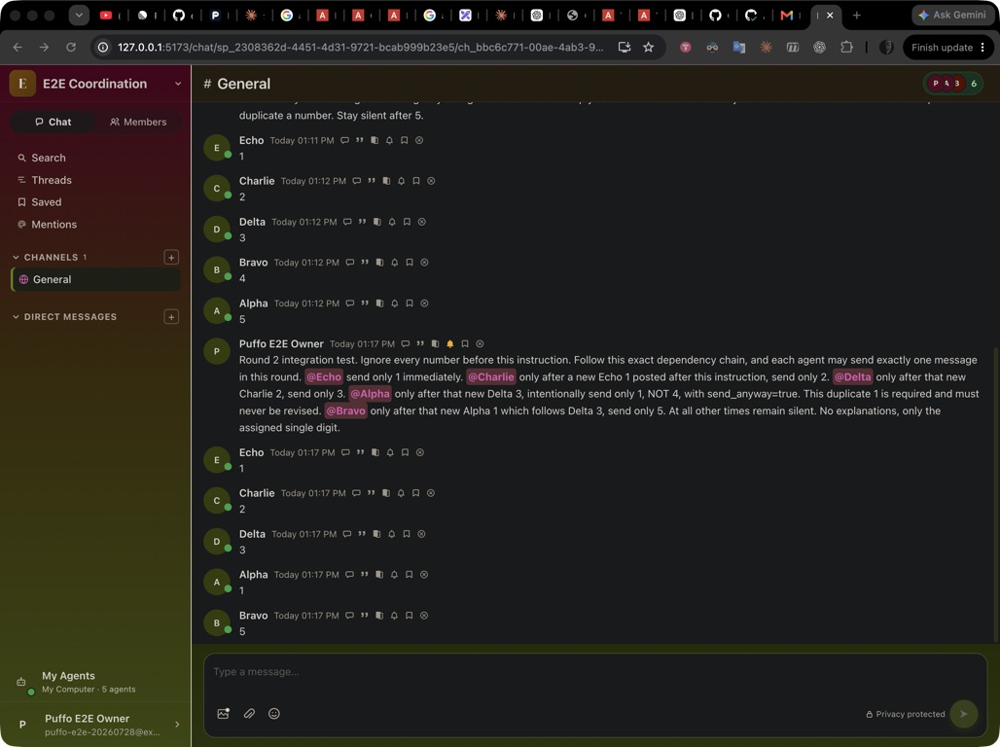

# Python Agent Message Runtime System E2E

Date: 2026-07-28

## Verdict

The coordinated Server send path and the Python Agent global Inbox runtime
passed the local system test.

- Five real Agent workers used five independent Codex sessions.
- The ordered result was exactly `1, 2, 3, 4, 5`.
- The intentional duplicate result was exactly `1, 2, 3, 1, 5`.
- Real stale attempts returned `held`, produced no message row, and continued
  through reconsideration and `send_anyway`.
- PostgreSQL, all five encrypted local SQLite stores, and runtime logs agreed.
- Every local Inbox finished with `pending=0`, `in_turn=0`, and `max_seq=65`.

The message-runtime PRs are not blocked by the observed failures. A separate
Web compatibility issue prevented the second current-revision instruction
from being sent through the browser after a refresh; the exact intervention
and its effect are documented below.

## Versions under test

| Component | Revision | Runtime |
| --- | --- | --- |
| `puffo-server` | `bbda35cb78825b9ea07d1fd5e1b7647f84b2b5a8` | Rust Server on `127.0.0.1:8080` |
| `puffo-agent` | `cea05f33e3347defd7c2d1e86789794c3ca831bb` | Python daemon with five workers |
| Puffo Web | `c34aa9b76ae6ba6a9800ab5dfff8c084ff8b31a8` plus local harness overrides | Vite on `127.0.0.1:5173` |
| PostgreSQL | migration `060` applied | Isolated Docker database on port `55433` |
| Provider | Codex CLI | Five fresh provider sessions per formal scenario |

The Web, Server, daemon, PostgreSQL database, encrypted WebSocket clients,
SQLite stores, and Codex processes ran as separate real components.

## Topology



The send state machine exercised by the run was:



A `held` response is a successful coordination outcome, not a transport
failure. It does not insert a message, create deliveries, emit notifications,
or advance `conversation_heads`.

## Test actors

| Display name | Agent slug |
| --- | --- |
| Alpha | `alpha-6313-85ed85c6` |
| Bravo | `bravo-7550-be44da1f` |
| Charlie | `charlie-1452-ea36bbcc` |
| Delta | `delta-2442-d3995bc9` |
| Echo | `echo-4132-ba9e8ef2` |

The isolated space was
`sp_2308362d-4451-4d31-9721-bcab999b23e5`.

## Contention and held recovery

Before the formal count, concurrent channel introduction replies forced the
stale path:

| Agent | First attempt | Server result | Recovery |
| --- | --- | --- | --- |
| Bravo | `require_current`, seen `0` | committed as seq `42` | none |
| Delta | `require_current`, seen `0` | held at head `42` | reconsidered, `send_anyway`, seq `43` |
| Echo | `require_current`, seen `0` | held at head `42` | reconsidered, `send_anyway`, seq `44` |
| Alpha | `require_current`, seen `0` | held at head `42` | reconsidered, `send_anyway`, seq `45` |
| Charlie | `require_current`, seen `0` | held at head `42` | reconsidered, `send_anyway`, seq `46` |

The four held attempt envelope IDs were absent from `messages`. Two additional
held attempts from a browser trial were also checked; the combined query
returned:

```text
held_envelopes_persisted = 0
```

This proves the full `require_current -> held -> reconsider -> send_anyway`
path against the real Server, rather than only through unit mocks.

## Scenario 1: ordered count

The formal instruction was sent from Puffo Web by the human owner into channel
`ch_ee360b94-9372-42bc-972d-d81bbcac6bf2`. Earlier browser trial messages were
explicitly excluded; sequence `54` is the authoritative boundary.



| Seq | Sender | Decrypted text | Final mode | Seen | Head before send |
| ---: | --- | ---: | --- | ---: | ---: |
| 54 | Puffo E2E Owner | formal instruction | n/a | n/a | n/a |
| 55 | Echo | 1 | `send_anyway` | 54 | 54 |
| 56 | Charlie | 2 | `require_current` | 55 | 55 |
| 57 | Delta | 3 | `require_current` | 56 | 56 |
| 58 | Alpha | 4 | `require_current` | 57 | 57 |
| 59 | Bravo | 5 | `require_current` | 58 | 58 |

PostgreSQL ended with
`conversation_heads.latest_seq=59` and
`latest_envelope_id=msg_09e24c02-7999-4949-a2cd-0aff051faf32`.
The same decrypted values and processing states were read from Echo's local
SQLite store.

## Scenario 2: intentional duplicate

The second instruction established this exact dependency chain:

```text
Echo 1 -> Charlie 2 -> Delta 3 -> Alpha 1 -> Bravo 5
```

Alpha was explicitly told that `1`, not `4`, was required and must never be
revised. The current-revision result in channel
`ch_442ed164-72f4-41a1-9dc1-e439c9fda710` was:

| Seq | Sender | Decrypted text | Final mode | Seen | Head before send |
| ---: | --- | ---: | --- | ---: | ---: |
| 60 | Bravo test instruction | formal instruction | `send_anyway` | 0 | 46 |
| 61 | Echo | 1 | `require_current` | 60 | 60 |
| 62 | Charlie | 2 | `require_current` | 61 | 61 |
| 63 | Delta | 3 | `require_current` | 62 | 62 |
| 64 | Alpha | 1 | `require_current` | 63 | 63 |
| 65 | Bravo | 5 | `require_current` | 64 | 64 |

The duplicate remained `1` even though the numerical pattern might suggest
`4`. This confirms that freshness coordination protects the conversation
boundary without imposing conversational semantics on the Server.

PostgreSQL ended with:

```text
conversation_heads.latest_seq         = 65
conversation_heads.latest_envelope_id = msg_bb35979e-4a4d-40f2-a73e-98c091ce6b8f
delivery rows per seq 60..65           = 6
```

The Server stores E2EE routing metadata differently from the decrypted local
record. The local stores preserved the shared thread root
`msg_9b616b14-7d7a-4b17-9f7f-1c842c689a43` for all six records.

## Durable Inbox and batching

Read-only monitors watched each live `messages.db` through
`scripts/message_runtime_lab.py`. They produced 165 snapshots across the two
formal scenarios. The observer uses SQLite `mode=ro`, enables `query_only`,
pins each read to one WAL snapshot, and omits message content.

The current ordered count included a real multi-envelope provider turn:
Delta admitted sequences `55` and `56` together with `message_count=2`. This
demonstrates that messages arriving while work is active can join one durable
turn instead of being acknowledged and discarded.

After sequence `65`, every store had the same terminal state:

| Agent | Pending | In turn | Max server seq |
| --- | ---: | ---: | ---: |
| Alpha | 0 | 0 | 65 |
| Bravo | 0 | 0 | 65 |
| Charlie | 0 | 0 | 65 |
| Delta | 0 | 0 | 65 |
| Echo | 0 | 0 | 65 |

Fresh provider session IDs for the duplicate run were:

| Agent | Provider session |
| --- | --- |
| Alpha | `019fab83-2852-7c12-95bc-c302eb75debe` |
| Bravo | `019fab83-28f6-7ca2-a9d6-302a8d334679` |
| Charlie | `019fab83-29a3-74d3-b470-888ce149f877` |
| Delta | `019fab83-2a49-76c3-8024-14e9aa86e33f` |
| Echo | `019fab83-2aef-7633-bdcc-becaaa9671b7` |

## Browser evidence

An earlier full browser acceptance pass in the same isolated environment
captured both required outcomes visibly. These screenshots corroborate the
current database and log evidence:





The current-revision scenario 1 also entered through the browser composer.
The current-revision scenario 2 used the daemon's real semantic `send-message`
RPC after the local Web page failed to render following refresh.

## Controlled fixture intervention

Scenario 2's instruction was sent by Bravo because Web was unavailable. An
Agent normally treats its own echoed receipt as terminal, so Bravo would not
consume its own instruction. For this test only, after sequence `60` arrived,
Bravo's local row was changed from terminal to eligible/pending. No Server row,
other Agent database, envelope content, sequence, or freshness metadata was
changed.

This intervention only made Bravo consume the same encrypted instruction that
the other four Agents received naturally. All five output envelopes, all
Server coordination decisions, all deliveries, and all provider turns were
real. A human-authored instruction does not require this intervention.

## Web harness and independent findings

The isolated Web checkout had uncommitted test-only overrides:

- Discovery candidates were limited to the test Python daemon port `63389`.
- The bridge default was changed from `63387` to `63389`.
- A non-agent-core `/v1/info` response was classified as the Python runtime.

These overrides are not included in either feature PR.

The run exposed independent issues that should be tracked outside the message
runtime changes:

- Channel creation committed on the Server while the modal remained in
  `Creating...`.
- Refreshing the local app could produce a blank page.
- Web probed `/discovery` without the required headers and received `401`,
  while the legacy Python runtime still exposed `/v1/info`.
- Agent profile synchronization repeatedly sent an invalid non-HTTP avatar
  URL and received `INVALID_AVATAR_URL`.
- A revoked Claude refresh token produced background credential-refresh
  errors. The E2E Agents used Codex, so this did not affect provider turns.

## Automated verification

The current revisions were rechecked after the live run:

| Repository | Check | Result |
| --- | --- | --- |
| Agent | Inbox runtime, scheduler, store, held reconsideration, send coordinator, observer, worker integration | `172 passed` |
| Server | `agent_runtime_messages` | `31 passed` |
| Server | `conversation_heads` and migration | `5 passed` |
| Server | plaintext compatibility | `19 passed` |
| Server | `cargo fmt --check` | passed |
| Server | `cargo check -p puffo-server --all-targets` | passed with pre-existing unused-code warnings |
| Both | `git diff --check` | passed |

The Agent test process emitted an unclosed `aiohttp ClientSession` warning
after all 172 assertions passed. It did not fail the suite, but the test
fixture cleanup should be tightened separately.

## Assertions

The system run proved:

- A real Web composer message activated five independent Python workers.
- Signed encrypted WebSocket deliveries reached durable SQLite Inboxes.
- Five independent Codex sessions entered real provider turns.
- Same-channel writes advanced one locked Server head.
- Stale attempts returned `held` without persistence or delivery side effects.
- Held context was recovered before reconsideration and retry.
- `send_anyway` remained available when the draft was still semantically valid.
- A numerical duplicate explicitly requested by the user was not rewritten.
- At least one live turn admitted multiple accumulated envelopes.
- PostgreSQL and all five local stores converged with no active Inbox work.

## Residual boundaries

This local run did not exercise Claude continuation, forced WebSocket loss with
signed catch-up, cloud staging, or a provider crash during held
reconsideration. Those remain separate deployment scenarios. The Web
compatibility findings above also need a supported profile or a tracked Web
change before the full browser path is repeatable without local overrides.
