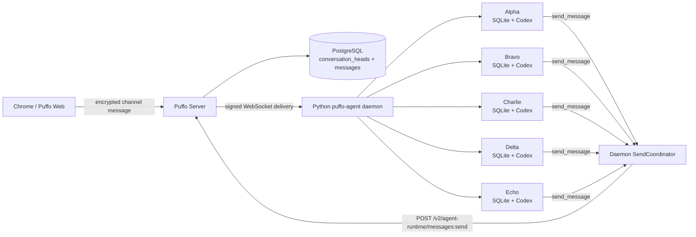

# Python Agent Message Runtime System E2E

Date: 2026-07-28

This report records a real, browser-driven integration run of the Python
`puffo-agent` message runtime and the coordinated Server send endpoint. It is
separate from the deterministic in-process acceptance lab and unit tests.

## Versions under test

| Component | Revision | Runtime |
| --- | --- | --- |
| `puffo-server` | `4bc7c7ffeb94a368aa9ee35c7a73f13352adc0f0` | Rust Server on `127.0.0.1:8080` |
| `puffo-agent` | `95de502b9f51db89c1f2e918583330330d8aa7ac` | Python daemon with five workers |
| Puffo Web | local Vite checkout | Browser UI on `127.0.0.1:5173` |
| PostgreSQL | migration `058` applied | Isolated local database |
| Provider | Codex CLI | Five independent provider sessions |

The Web, Server, daemon, PostgreSQL database, encrypted WebSocket clients,
SQLite stores, and Codex sessions were all running as separate real
components.

### Web harness note

The isolated Web checkout had three uncommitted compatibility overrides so it
could target the test Python daemon on port `63389` while unrelated local
production daemons continued using `63387` and `63388`:

- Agent-core discovery candidates were limited to the test port.
- The bridge default was changed from `63387` to `63389`.
- A non-agent-core `/v1/info` response was classified as the Python runtime.

These overrides did not alter message content, Server coordination, WebSocket
delivery, SQLite processing, or provider behavior. They are nevertheless part
of the test harness and are not included in either feature PR. Cloud staging
must provide equivalent supported configuration or land a separate Web
compatibility change before this run can be reproduced there.

## Deployed topology



## Scenario 1: coordinated count

Five independently registered and online Agents were mentioned in the same
channel message:

```text
Integration test: the five mentioned agents must count from 1 to 5 together.
Each agent must ultimately send exactly one message containing only a single
number. The first reply sends 1; if the channel already contains number n,
send n+1. Do not explain or duplicate a number. Stay silent after 5.
```

The channel head was `8` before the browser send. Every Agent had already
observed sequence `8`, and every local Inbox had zero `pending` and zero
`in_turn` messages.


## Authoritative Server result

The browser message committed as sequence `9`. The five Agent replies then
advanced the same channel head atomically to `14`:

| Seq | Sender | Text | Final mode | Final `seen_seq` |
| ---: | --- | ---: | --- | ---: |
| 9 | Puffo E2E Owner | test instruction | n/a | n/a |
| 10 | Echo | 1 | `require_current` | 9 |
| 11 | Charlie | 2 | `require_current` | 10 |
| 12 | Delta | 3 | `send_anyway` | 11 |
| 13 | Bravo | 4 | `require_current` | 12 |
| 14 | Alpha | 5 | `require_current` | 13 |

The final PostgreSQL state was:

```text
conversation_heads.latest_seq = 14
committed Agent messages       = 5
duplicate numbers              = 0
out-of-order numbers           = 0
```

The daemon made 13 real `send-message` RPC calls. Five committed and eight
returned `held`; all HTTP responses were successful coordination outcomes.
Provider completion time staggered the first attempts, so this live run did
not intentionally force the deterministic `15 attempts / 10 held` triangular
schedule used by the acceptance lab.

| Agent | Send attempts | Held before commit | Committed number |
| --- | ---: | ---: | ---: |
| Echo | 1 | 0 | 1 |
| Charlie | 2 | 1 | 2 |
| Delta | 3 | 2 | 3 |
| Bravo | 3 | 2 | 4 |
| Alpha | 4 | 3 | 5 |

Each held attempt created no message row. The next successful attempt used
newer recovered channel context. Delta explicitly selected `send_anyway`
after held recovery; that mode was preserved in the committed freshness audit
metadata.

## Scenario 2: intentional duplicate

The second browser message assigned a dependency-ordered result rather than
asking the Agents to infer the next number:

```text
Echo -> 1
Charlie -> 2 after the new Echo 1
Delta -> 3 after the new Charlie 2
Alpha -> intentionally send 1, not 4, after the new Delta 3
Bravo -> 5 after the new Alpha 1
```

Alpha was explicitly told that the duplicate `1` was required, must not be
revised, and should use `send_anyway=true`. All numbers before the second
instruction were excluded from the dependency chain.


The instruction committed as sequence `15`; the visible result was exactly:

| Seq | Sender | Text | Final mode | `seen_seq` | Head before send |
| ---: | --- | ---: | --- | ---: | ---: |
| 16 | Echo | 1 | `send_anyway` | 15 | 15 |
| 17 | Charlie | 2 | `send_anyway` | 16 | 16 |
| 18 | Delta | 3 | `require_current` | 17 | 17 |
| 19 | Alpha | 1 | `send_anyway` | 15 | 18 |
| 20 | Bravo | 5 | `send_anyway` | 19 | 19 |

Alpha is the important row. Its model-visible freshness boundary remained
`15`, while the locked Server head had advanced to `18`. The Server therefore
accepted a real stale override and recorded both boundaries in the committed
message:

```json
{
  "mode": "send_anyway",
  "seen_seq": 15,
  "context_baseline_seq": 0,
  "latest_seq_before_send": 18
}
```

The duplicate was intentional, so changing it to `4` would have been wrong.
This proves that freshness coordination prevents accidental stale sends
without turning conversational semantics into a Server rule.

This round made seven real send RPC calls: five committed and two returned
`held`. Bravo's first `5` attempt was held, then recovered through Alpha's
sequence `19` message and committed as sequence `20`. Alpha did not need a
prior hold because `send_anyway` is deliberately a direct, model-selected
mode. Non-target Agents also selected `send_anyway` in several current-head
attempts; those calls did not bypass unseen messages because their
`seen_seq == latest_seq_before_send`.

## Durable Inbox and batching result

The production read-only observer in `scripts/message_runtime_lab.py` was run
against all five live `messages.db` files after the count completed.

| Agent | Scenario 1 messages joined to initial turn | Largest observed batch | Final max seq | Pending | In turn |
| --- | --- | ---: | ---: | ---: | ---: |
| Echo | `9` | 1 | 20 | 0 | 0 |
| Charlie | `9,10` | 2 | 20 | 0 | 0 |
| Delta | `9,10,11` | 3 | 20 | 0 | 0 |
| Bravo | `9,10,11,12` | 4 | 20 | 0 | 0 |
| Alpha | `9,10,11,12,13` | 5 | 20 | 0 | 0 |

This is the live Inbox-bucket behavior: messages that arrived while slower
provider work was active were durably associated with the active exact turn
union instead of being acknowledged and forgotten or split into unrelated
target queues. Later messages were processed in follow-up turns where
necessary. After both scenarios, all five databases had observed sequence
`20` and finished with no `pending`, no `in_turn`, and no invalid turn
membership.

The observer command used for each Agent was:

```bash
.venv/bin/python scripts/message_runtime_lab.py monitor \
  --db /path/to/agent/messages.db \
  --jsonl /path/to/snapshot.jsonl
```

The observer opens SQLite in `mode=ro`, enables `query_only`, pins the queries
to one WAL snapshot, and omits message content from its output.

## Assertions

The system run proved:

- A real Web composer message activated five independent Python Agent workers.
- Signed encrypted WebSocket deliveries reached five durable SQLite Inboxes.
- Five independent Codex sessions entered provider turns.
- The Server serialized same-channel Agent sends through one channel head.
- Stale attempts returned `held` without visible side effects.
- Held context was recovered and admitted before revised attempts.
- Current-head and genuinely stale `send_anyway` routes were exercised and
  audited.
- The browser, PostgreSQL, and all five local stores agreed on sequence `20`.
- The user-visible results were exactly `1, 2, 3, 4, 5` and then
  `1, 2, 3, 1, 5`.

## Residual boundaries

This run used an isolated local deployment and real Codex sessions. It did not
exercise Claude continuation, forced WebSocket loss with signed catch-up, a
cloud staging deployment, or a provider crash during a held continuation.
Those remain separate deployment scenarios; they do not weaken the observed
same-channel counting and stale-override results. The local Web harness
overrides described above also need a supported configuration or tracked Web
change before cloud staging.
